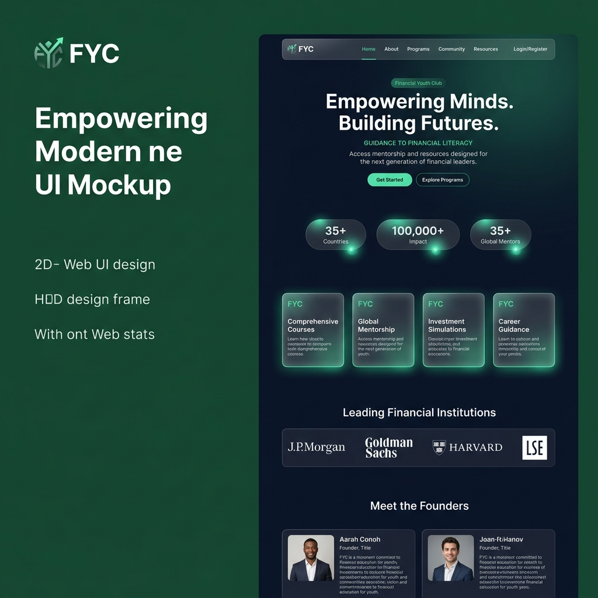
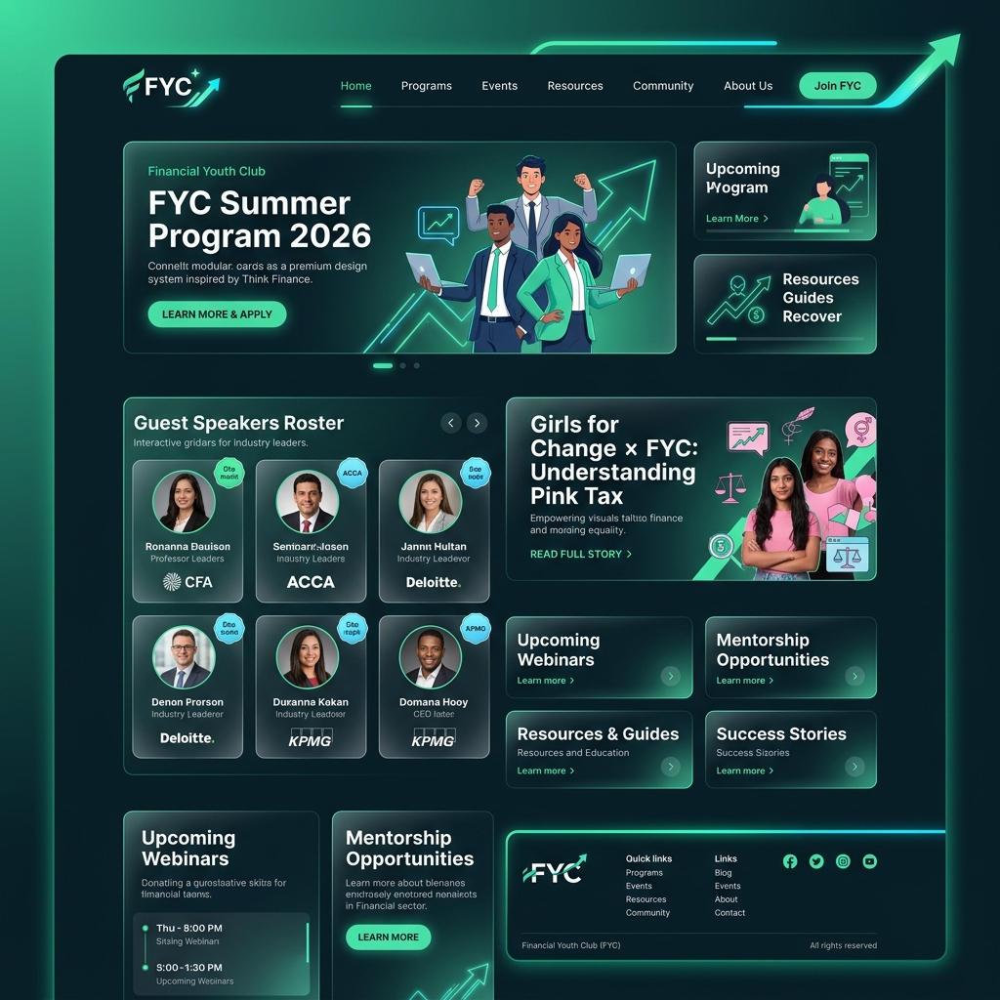
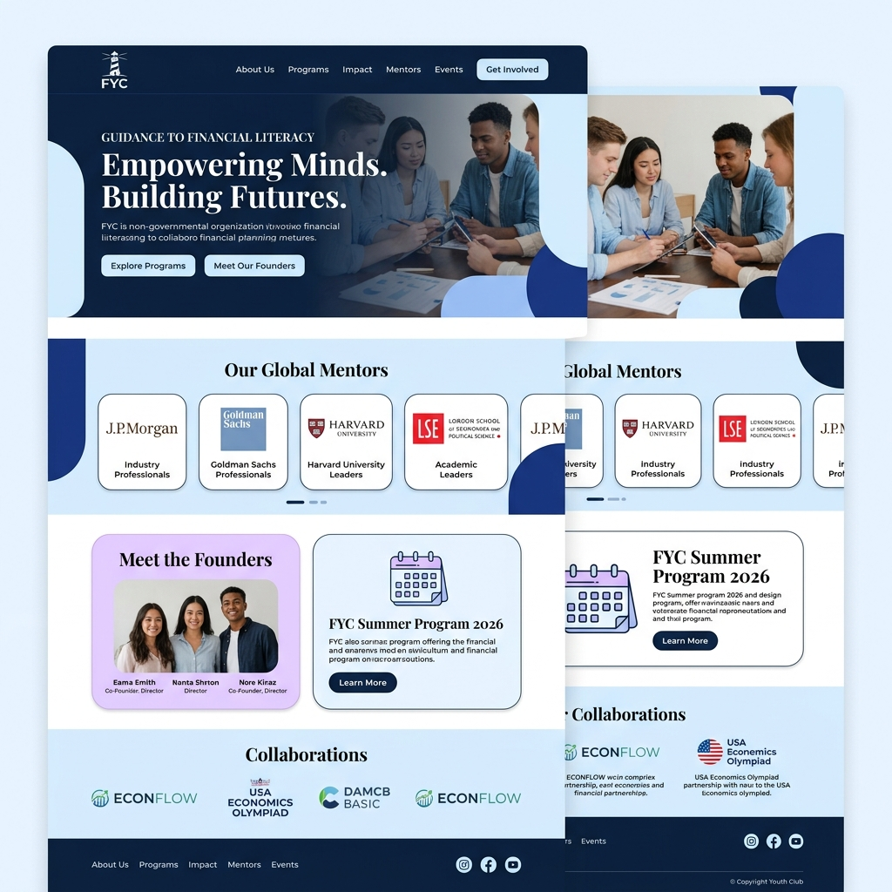
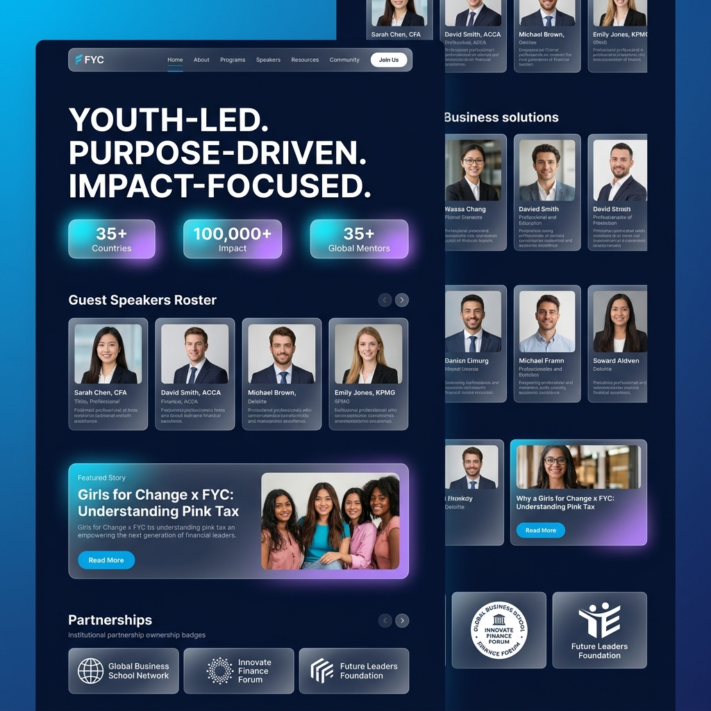

# Financial Youth Club (FYC) - MERN Application

Youth-Led. Purpose-Driven. Impact-Focused.  
Guidance To Financial Literacy Across 35+ Countries!

---

## 📁 Repository Structure Overview

```text
FYC-WEB/
│
├── frontend/             # React.js client built with Vite & Vanilla CSS
│   ├── public/           # Static assets and category images
│   ├── src/
│   │   ├── app/          # Core App container, router, and context providers
│   │   ├── components/   # Reusable UI & layout elements (Navbar, Footer, SpeakerCard)
│   │   ├── features/     # Feature-sliced modules (Home, Founders, Speakers, Programs, etc.)
│   │   ├── styles/       # HSL theme variables, glassmorphism, responsive grid CSS
│   │   └── main.jsx
│   └── package.json
│
├── backend/              # Node.js + Express backend API with MongoDB Mongoose
│   ├── src/
│   │   ├── app/          # Express setup & root route router
│   │   ├── config/       # Mongoose DB, Cloudinary & environment configs
│   │   ├── controllers/  # Request handlers for auth, founders, speakers, programs, etc.
│   │   ├── models/       # Mongoose data schemas
│   │   ├── repositories/ # Data access layer
│   │   ├── routes/       # API endpoints definition
│   │   └── services/     # Business logic layer
│   └── server.js
│
├── fyc_think_finance_v1.png # Think-Finance Inspired Design V1 (Emerald Forest & Dark Slate)
├── fyc_think_finance_v2.png # Think-Finance Inspired Design V2 (Emerald Navy & Glowing Mint)
├── fyc_design_v1.png        # Authentic Brand Concept 1 (Royal Navy & Ice Blue Magazine Style)
├── fyc_design_v2.png        # Authentic Brand Concept 2 (Deep Navy Global Hub)
└── README.md
```

---

## 🎨 Visual Design Mockups

### 🌿 Think-Finance Inspired Designs

#### Design Concept 1: Emerald Forest & Dark Slate (Think-Finance Style V1)


#### Design Concept 2: Emerald Navy & Glowing Mint (Think-Finance Style V2)


---

### 🔷 Authentic Instagram Brand Designs

#### Design Concept 3: Brand Authentic (Royal Navy & Ice Blue Magazine Style)


#### Design Concept 4: Global Youth Hub (Deep Navy with Cyan & Lavender Glows)

